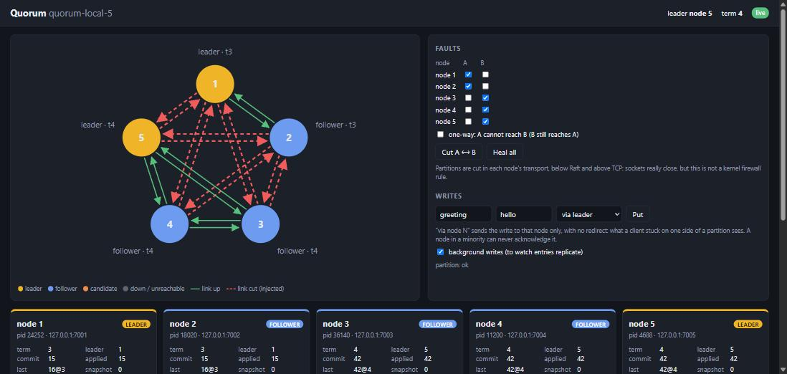

# Quorum

**A fault-tolerant replicated key-value store built on a from-scratch Raft
implementation — and the evidence that it works.**

Raft is the consensus algorithm that lets several machines hold one trustworthy
shared answer even when individual machines crash, freeze or lose contact with
each other. Quorum runs three to five nodes as separate local processes, each
holding an identical copy of the store, and guarantees that as long as a
majority of them are alive and can talk to each other, reads and writes stay
correct and consistent — even mid-failure. It implements leader election with
randomized timeouts, log replication that only commits an entry once a majority
have durably recorded it, crash-safe persistence, snapshots and log
compaction, and linearizable GET and PUT over gRPC: a client is guaranteed to
see the effects of every write it has already been told succeeded, even if the
leader that accepted it later dies. This is the same underlying problem etcd
solves for Kubernetes' cluster state.

The point of the project is not that it works but that **every claim it makes
is backed by a test that would fail if the claim were false** — and every one
of those tests has itself been seen to fail against a deliberately broken
input.



*The live visualizer mid-partition: nodes 1 and 2 are cut off (red dashed
links). Node 1 still believes it leads, in term 3, but cannot commit; the
majority elected node 5 in term 4 and carries on. The full
[walkthrough](docs/walkthrough/README.md) goes through an election, this
partition with the minority refusing a write, a heal, and a leader kill with
recovery.*

---

## Two commands

Requires **Go 1.27+** and nothing else: generated protobuf code is checked in.

```bash
git clone https://github.com/Shashankkaranamr/Quorum && cd Quorum
make viz       # start a 3-node cluster and serve the live visualizer at http://127.0.0.1:8080
make faults    # run the full real-process fault suite: kills, partitions, freezes, chaos
```

On Windows, where `make` is usually absent, `make.ps1` mirrors every target —
`.\make.ps1 viz`, `.\make.ps1 faults` — and a test fails if the two ever
drift apart. Both commands were verified from a fresh clone.

`make viz` uses [`cluster.yaml`](cluster.yaml); `make viz CONFIG=cluster-5.yaml`
(`.\make.ps1 viz -Config cluster-5.yaml`) runs five nodes. The visualizer leaves the nodes running when it exits;
`make down` kills them. The same cluster can be driven from a terminal:

```bash
bin/quorumctl put greeting hello
bin/quorumctl get greeting            # prints: hello
bin/quorumctl status                  # role, term, commit index per node
bin/quorumctl kill 1                  # a real TerminateProcess / SIGKILL
bin/quorumctl partition 2 '|' 3       # cut links (transport-level, not a firewall)
bin/quorumctl partition -oneway 1 '|' 2,3
bin/quorumctl freeze 3                # park node 3's loop (cooperative, not SIGSTOP)
bin/quorumctl heal
bin/quorumctl down                    # kill every node
```

`make help` lists every target. `make ci` runs everything: format check, lint,
build, the full test suite including the real-process integration suite, and
all of it again under the race detector — with the node processes themselves
built with `-race`. It takes about six minutes; `go test -short ./...` skips
the real-process tests for a quick loop.

> **`make race` needs a 64-bit C compiler**, because Go's race detector needs
> cgo. That is the default on Linux and macOS. On Windows it often is not — an
> old 32-bit MinGW earlier on PATH fails with `sorry, unimplemented: 64-bit mode
> not compiled in`, which reads like a Go problem and is not. `make.ps1` looks
> for a usable compiler itself; if it finds none, install one with
> `winget install BrechtSanders.WinLibs.POSIX.UCRT`.
>
> Regenerating the protobuf code (`make proto`) additionally needs `make tools`
> once. Neither is needed just to build or test.

---

## How it is put together

The one structural idea everything follows from: **the consensus algorithm is a
pure state machine, and all I/O lives outside it.**

```
                  ┌──────────────────────────── quorum-node (one OS process each) ─────┐
                  │                                                                     │
 quorumctl ──────▶│  kvservice ──┐                        admin ◀─── status snapshot   │
 client lib       │  (gRPC KV)   │ propose / ReadIndex    (gRPC)      (atomic pointer)  │
                  │              ▼                                                      │
                  │     ┌──────────────────┐   Tick / Step / Ready   ┌──────────────┐  │
                  │     │  server.Loop     │────────────────────────▶│    raft      │  │
                  │     │  one goroutine   │◀────────────────────────│  pure state  │  │
                  │     │  owns everything │                         │  machine:    │  │
                  │     └──┬──────┬──────┬─┘                         │  no I/O, no  │  │
                  │        │      │      │                           │  clock, no   │  │
                  │  Append│  Send│ Apply│                           │  locks       │  │
                  │        ▼      ▼      ▼                           └──────────────┘  │
                  │     storage  grpcx  statemachine                                   │
                  │     (WAL,    (one   (KV map +                                      │
                  │     snap-    stream  sessions)                                     │
                  │     shots)   per link)                                             │
                  └───────────────┬──────────────────────────────────────────▲─────────┘
                                  │ gRPC streams to peer processes           │ WatchStatus,
                                  ▼                                          │ BlockLinks, Freeze
                             other nodes          supervisor (spawn / kill) ─┤
                                                  quorum-viz (browser, SSE) ─┘
```

Package `raft` has no clock, no network, no disk, no goroutines and no locks.
Logical time advances only when `Tick()` is called; randomness is injected. One
goroutine (`server.Loop`) owns the node, its storage, its state machine and
every pending client request, so there is no shared Raft state and nothing to
lock — which makes the classic failure of holding a lock across an fsync
structurally impossible. That is checked, not asserted: `raft/purity_test.go`
walks the package's imports against an allowlist and rejects concurrency
primitives, with a negative control proving the checker fails when the core is
made impure.

The same purity is what makes the testing credible. The deterministic
simulator, which runs thousands of seeded trials checking Raft's safety
properties after every simulated tick, and the real multi-process deployment
run **identical consensus code** — only the clock and two I/O interfaces
differ. What the simulator cannot cover (the gRPC transport, WAL file I/O, the
goroutine wiring) is covered by the real-process suite.

Every node obeys one ordering rule, the most load-bearing sequence in the
project: **no message leaves a node before what it promises is fsynced.** A
granted vote and an acknowledged append are durable promises; etcd relaxes this
for throughput and Quorum does not. `TestNoSendBeforeSync` audits every message
every node sends, at the instant it is sent, against what that node had made
durable.

```
raft/            pure consensus core — the only exported package
internal/
  server/        the driver: Ready ordering, and the goroutine loop
  storage/       write-ahead log, snapshots, framing codec
  statemachine/  KV map + client session table
  transport/     interface, with inmem/ (simulator) and grpcx/ (real gRPC)
  kvservice/     client API, ReadIndex reads, leader redirect
  client/        client library: sessions, retries, redirects
  node/          assembles one replica
  admin/         status and fault injection
  supervisor/    spawn, kill and restart node processes
  viz/           the visualizer backend
  config/        cluster.yaml loading and validation
  testutil/      simulator, invariant checkers, linearizability model
cmd/             quorum-node, quorumctl, quorum-viz
web/             the visualizer page, embedded in quorum-viz
proto/           schemas for the log format, KV contract and admin API
```

---

## What it will and will not guarantee

**It will guarantee:**

- **Linearizable single-key reads and writes**, as long as a majority of nodes
  are alive and can reach each other. Reads use ReadIndex — a leader confirms
  with a quorum before answering — never a leader lease.
- **At-most-once application of client commands** within a live session, across
  retries after ambiguous failures.
- **Durability of acknowledged writes** across process crashes and OS crashes.
- **No committed entry is lost, reordered, or overwritten**, and no two nodes
  apply different commands at the same log index.
- **A minority partition cannot commit anything.** It returns errors rather than
  false successes.

**It will not guarantee:**

- **No Byzantine fault tolerance.** Nodes fail by crashing, not by lying; there
  is no message authentication and no TLS.
- **No dynamic membership.** Cluster size is fixed at startup.
- **Localhost, single machine only.**
- **No multi-key transactions**, ranges or watches.
- **No throughput tuning.** Correctness wins everywhere the two conflict.
- **No protection against hardware that lies about flushes.**
- **No liveness under pathological message loss** — safety always, liveness
  only under partial synchrony.
- **Session expiry is not implemented**, and a session is never garbage
  collected.
- **No authentication** on the client or admin API.

Two things the demo deliberately does not overstate: injected **partitions are
enforced in each node's transport layer** — sockets really close, but it is not
a kernel firewall rule — and **freeze is cooperative**: the node's event loop
parks itself; it is not `SIGSTOP`. Kills, however, are real `TerminateProcess` /
`SIGKILL`. The reasoning for each is in
[DESIGN.md §6](DESIGN.md#6-what-this-will-and-will-not-guarantee).

---

## The evidence

Every guarantee above names the tests that would fail if it were false, and
every test named here exists — `TestEveryGuaranteeNamesExistingTests` fails the
build otherwise, and a second test fails if this table and
[DESIGN.md §7](DESIGN.md#7-claim-to-test-traceability) ever disagree.

### The guarantees in §6

| Guarantee | Tests |
|---|---|
| Linearizable single-key reads and writes | `TestLinearizabilityUnderFaults`, `TestChaosSeeded` (Porcupine over histories recorded under kills, partitions, one-way cuts and freezes), `TestPartitionedLeaderRefusesRead` |
| At-most-once application of client commands | `TestAmbiguousRetryAppliesOnce`, `TestSessionsSurviveSnapshot` |
| Durability of acknowledged writes | Process crashes: `TestAckedWritesSurviveLeaderKill`, `TestRollingRestart`, `TestProcessesServeReadsAndWrites` and `TestKilledNodeRecovers`, all killing real processes; `TestClusterRestartRecoversCommitted` and `TestWALTruncationAtEveryOffset` on the recovery path. **OS crashes are not tested**: the suite cannot crash the operating system. That half of the claim rests on nothing being acknowledged before it is fsynced (`TestNoSendBeforeSync`, `TestOneFsyncPerReady`) and on the OS honouring `fsync`/`FlushFileBuffers`, whose limits §2 states. |
| No committed entry is lost, reordered, or overwritten | `CommittedEntriesAreStable`, `StateMachineSafety`, `LogMatching` and `SnapshotFidelity` checked after every tick by `TestRandomizedTrialsUpholdSafety`, `TestRandomizedTrialsUpholdSafetyOnDisk` and `TestRandomizedTrialsUpholdSafetyWithSnapshots`; `TestMinorityPartitionRefusesWrites` on real processes |
| A minority partition cannot commit anything. | `TestMinorityPartitionCannotCommit` (simulator), `TestMinorityPartitionRefusesWrites` (five real processes) |

### Every claim, and the test behind it

| Claim | Test | Phase |
|---|---|---|
| The consensus core performs no I/O | `TestRaftCoreImportAllowlist`, `TestRaftCoreDoesNotWriteToStdout` | ✅ 1 |
| That purity check can actually fail | `TestImportAllowlistCheckerDetectsViolations` | ✅ 1 |
| A misconfigured cluster is rejected at startup | `TestLoadRejectsBadConfigs` | ✅ 1 |
| The core performs no concurrency either | `TestRaftCoreHasNoConcurrencyPrimitives` | ✅ 2 |
| Exactly one leader per term | `ElectionSafety` checker, asserted every tick by `TestRandomizedTrialsUpholdSafety` | ✅ 2 |
| Leader Append-Only holds | `LeaderAppendOnly` checker, every tick | ✅ 2 |
| Log Matching holds | `LogMatching` checker, every tick | ✅ 2 |
| Leader Completeness holds | `LeaderCompleteness` checker, on every election | ✅ 2 |
| State Machine Safety holds | `StateMachineSafety` checker, on every apply | ✅ 2 |
| A committed entry is never altered | `CommittedEntriesAreStable` checker, every tick | ✅ 2 |
| Every checker can actually fail | `TestMutatedRaftTripsInvariant/*` and `TestCheckerDetectsHandBuiltViolations/*` | ✅ 2 |
| The checkers accept a healthy history | `TestCheckerAcceptsAHealthyHistory` | ✅ 2 |
| An old-term entry is not committed by replica count (Figure 8) | `TestFigure8CommitRule` | ✅ 2 |
| The §5.4.1 up-to-date comparison is the right way round | `TestUpToDateComparison` | ✅ 2 |
| The election timer resets only on a granted vote or a leader's AppendEntries | `TestElectionTimerResetDiscipline` | ✅ 2 |
| A stale or duplicated AppendEntries never truncates the log | `TestStaleAppendEntriesDoesNotTruncate` | ✅ 2 |
| Elections converge within the bound | `TestElectionConverges` (1000 seeds), `TestLivenessBoundUnderTransientFaults` | ✅ 2 |
| A minority partition cannot commit | `TestMinorityPartitionCannotCommit` | ✅ 2 |
| Committed entries survive a leader kill | `TestLeaderFailoverPreservesCommitted` | ✅ 2 |
| Tick lag is measurable | `TestTickLagIsMeasured` | ✅ 2 |
| Wire and disk encoding round-trip | `TestMessageRoundTrip`, `TestEntryTypeValuesMatch` | ✅ 2 |
| Nothing is sent before it is durable | `TestNoSendBeforeSync` | ✅ 3 |
| That audit can actually fail | `TestDurabilityAuditCatchesMisorderedDrivers` | ✅ 3 |
| One Sync per Ready; one fsync per Ready with durable state, never more | `TestOneFsyncPerReady` | ✅ 3 |
| The WAL decoder never accepts a torn, partial or CRC-mismatched record | `FuzzWALDecode`, `TestWALCodecRejectsEveryBitFlip` | ✅ 3 |
| That fuzz contract can actually fail | `TestDecodeContractCatchesBrokenDecoders` | ✅ 3 |
| Recovery from a torn WAL yields a prefix | `TestWALTruncationAtEveryOffset` | ✅ 3 |
| That prefix check can actually fail | `TestTruncationCheckDistinguishesEveryPrefix` | ✅ 3 |
| Damage that is not a torn tail is refused, not truncated | `TestWALRefusesDamageThatIsNotATornTail` | ✅ 3 |
| A restarted node never votes twice in a term | `TestRestartDoesNotDoubleVote` | ✅ 3 |
| That double-vote check can actually fail | `TestDoubleVoteCheckCatchesAmnesia` | ✅ 3 |
| A whole-cluster crash loses no committed entry | `TestClusterRestartRecoversCommitted` | ✅ 3 |
| That restart check can actually fail | `TestRestartCheckCatchesLostCommittedEntries` | ✅ 3 |
| The safety invariants hold with every node on real disk | `TestRandomizedTrialsUpholdSafetyOnDisk` | ✅ 3 |
| The simulator's crash model matches the real log | `TestWALAgreesWithMemStorage` | ✅ 3 |
| Crossing the threshold compacts, and deletes the superseded segments | `TestSnapshotAtThreshold` | ✅ 4 |
| Snapshot + tail reproduces exact state | `TestSnapshotRestoreIsIdentical` | ✅ 4 |
| That restore check can actually fail | `TestRestoreCheckCatchesALossyRestore` | ✅ 4 |
| A far-behind follower is caught up by InstallSnapshot, observed being sent | `TestFarBehindFollowerGetsSnapshot` | ✅ 4 |
| That count is not counting something else | `TestSnapshotCountIsZeroForANearbyFollower` | ✅ 4 |
| Dedup survives snapshot restore | `TestSessionsSurviveSnapshot` | ✅ 4 |
| That session check can actually fail | `TestSessionCheckCatchesASessionlessSnapshot` | ✅ 4 |
| A crash at any point while snapshotting is recoverable | `TestCrashDuringSnapshot` | ✅ 4 |
| That crash check can actually fail | `TestSnapshotCrashCheckCatchesMisorderedWrites` | ✅ 4 |
| A node whose data directory is deleted rejoins by snapshot | `TestWipedNodeCatchesUp` | ✅ 4 |
| Every replica's state is identical at every index, applied or restored | `SnapshotFidelity` checker, every tick of `TestRandomizedTrialsUpholdSafetyWithSnapshots` | ✅ 4 |
| That checker can actually fail | `TestSnapshotFidelityCatchesACorruptTransfer`, `TestCheckerHandlesCompactedLogs` | ✅ 4 |
| A snapshot is never acknowledged before it is durable | `TestNoSendBeforeSync` (snapshot variants) | ✅ 4 |
| That audit can actually fail for snapshots | `TestDurabilityAuditCatchesAnEarlySnapshotAck` | ✅ 4 |
| The simulator's storage matches the real log through snapshots | `TestWALAgreesWithMemStorageThroughSnapshots` | ✅ 4 |
| A real multi-process cluster serves reads and writes, and survives every process being killed | `TestProcessesServeReadsAndWrites` | ✅ 5 |
| A no-op opens every term, and the leader's commits in its own term | `TestNoopCommittedOnElection` | ✅ 5 |
| That no-op check can actually fail | `TestNoopCheckCatchesATermWithoutOne` | ✅ 5 |
| ReadIndex confirms only with a quorum, only after the term's first commit, and abandons reads on step-down | `TestReadIndexWaitsForAQuorum`, `TestReadIndexWaitsForTheTermsFirstCommit`, `TestReadsAreAbandonedOnStepDown` | ✅ 5 |
| A partitioned leader will not serve a stale read | `TestPartitionedLeaderRefusesRead` | ✅ 5 |
| That stale-read check can actually fail | `TestStaleReadCheckCatchesAQuorumlessRead` | ✅ 5 |
| A retried write applies exactly once | `TestAmbiguousRetryAppliesOnce` | ✅ 5 |
| That applied-once check can actually fail | `TestAppliedOnceCheckCatchesANaiveRetry` | ✅ 5 |
| A write to a follower is refused, redirected, and costs at most one extra attempt | `TestNotLeaderRedirect` | ✅ 5 |
| Client histories are linearizable under leader kills and partitions | `TestLinearizabilityUnderFaults` (Porcupine) | ✅ 5 |
| That linearizability check can actually fail, end to end and on a hand-built history | `TestLinearizabilityCatchesQuorumlessReads`, `TestLinearizabilityCheckerRejectsAStaleRead` | ✅ 5 |
| Partitions are directed, and heal | `TestPartitionIsDirectedAndHeals` | ✅ 5 |
| Injecting faults under traffic is race-free | `TestFaultStateIsSafeToChangeUnderTraffic`, under `make race` | ✅ 5 |
| Every goroutine exits when a node stops | goleak in `internal/node` and `internal/transport/grpcx` | ✅ 5 |
| The harness really kills (PID gone), restarts on the same data, partitions both ways and one way, heals, freezes and thaws | `TestHarnessInflictsRealFaults` | ✅ 6 |
| quorumctl drives every operation end to end | `TestQuorumctlDrivesTheCluster` | ✅ 6 |
| Acknowledged writes survive a leader kill, and a new leader appears within a bound | `TestAckedWritesSurviveLeaderKill` | ✅ 6 |
| That acknowledged-writes check can actually fail | `TestAckedCheckCatchesLostData` | ✅ 6 |
| A killed node recovers from disk | `TestKilledNodeRecovers` | ✅ 6 |
| A minority refuses writes, the majority continues, and healing reconciles the logs exactly | `TestMinorityPartitionRefusesWrites` | ✅ 6 |
| That log-convergence check can actually fail | `TestLogMatchCheckCatchesDivergence` | ✅ 6 |
| A rolling restart loses nothing and serves throughout | `TestRollingRestart` | ✅ 6 |
| Random fault schedules stay linearizable | `TestChaosSeeded` | ✅ 6 |
| A recorded PID is never acted on once it belongs to another program | `TestSupervisorIgnoresAStrangersPID` | ✅ 6 |
| This traceability section names only tests that exist, and covers every guarantee | `TestEveryGuaranteeNamesExistingTests`, `TestTraceabilityCheckCatchesGaps` | ✅ 6 |
| The visualizer shows each node's live state, a write reaching every node within 500ms | `TestVizShowsLiveState` (3 and 5 nodes) | ✅ 7 |
| The visualizer's kill is a real kill, and its start recovers from disk | `TestVizKillIsRealAndRestartRecovers` | ✅ 7 |
| The visualizer's partitions are real transport cuts, drawn per direction | `TestVizShowsDirectedPartitions` | ✅ 7 |
| An election is legible in the visualizer | `TestVizMakesElectionsLegible` | ✅ 7 |
| The visualizer cannot reach Raft state except through the admin and KV APIs | `TestVizCannotReachRaftState`, `TestRoutesAreExactlyTheDocumentedControls` | ✅ 7 |
| That structural check can actually fail | `TestNodeStateCheckFlagsANodeAssembly` | ✅ 7 |
| Another web page cannot press the visualizer's buttons | `TestControlsRefuseCrossSiteRequests` | ✅ 7 |
| The visualizer follows the config at 3 and 5 nodes | `TestShapeFollowsTheConfig` | ✅ 7 |
| The status stream keeps streaming while a node is frozen | `TestWatchStatusStreamsLiveState` | ✅ 7 |
| A client escapes a stale minority whose follower redirects back to the stale leader | `TestClientEscapesAStaleMinority`; the five-node run of `TestChaosSeeded` | ✅ 8 |
| A client pinned to a minority is never told its write succeeded | `TestPinnedClientSeesTheMinorityRefuse` | ✅ 8 |
| The README carries exactly this section's tables | `TestReadmeCarriesTheTraceabilityTable`, `TestReadmeCheckCatchesAStaleCopy` | ✅ 8 |

---

### What testing found

[BUGS.md](BUGS.md) records eleven bugs that testing actually found, each
with its symptom, root cause, fix and a regression test that was observed
failing before the fix. Five were in production code: a data race in the
transport's fault injection, a client trapped in a stale minority by honest
redirects, restarts forcing needless elections because two reconnect backoffs
outlasted the election timeout, a tick-lag metric that was structurally blind
in the real loop, and a leaked file handle in recovery's error path. The rest
were tests that could not fail, caught by their own negative controls.

No violation of a Raft safety property was found. That is a claim about what
the tests found, and it is worth something only because every checker has been
shown to catch a deliberately broken Raft: a node that votes twice, one that
skips the up-to-date check, one that commits by counting old-term replicas, a
leader that truncates its own log, a ReadIndex that skips its quorum.

---

## Documentation

| | |
|---|---|
| [docs/walkthrough](docs/walkthrough/README.md) | The recorded walkthrough of the visualizer |
| [DESIGN.md](DESIGN.md) | Every design decision and why, the guarantees, the claim-to-test table, and every place the implementation diverged from the plan |
| [BUGS.md](BUGS.md) | Bugs testing actually found, with the regression test guarding each |
| [PLAN.md](PLAN.md) | The 8-phase roadmap and how each acceptance criterion was met |
| [PROGRESS.md](PROGRESS.md) | Current state and open items |
| [CLAUDE.md](CLAUDE.md) | Working rules and invariants for anyone (or any agent) contributing |

## License

MIT — see [LICENSE](LICENSE).
