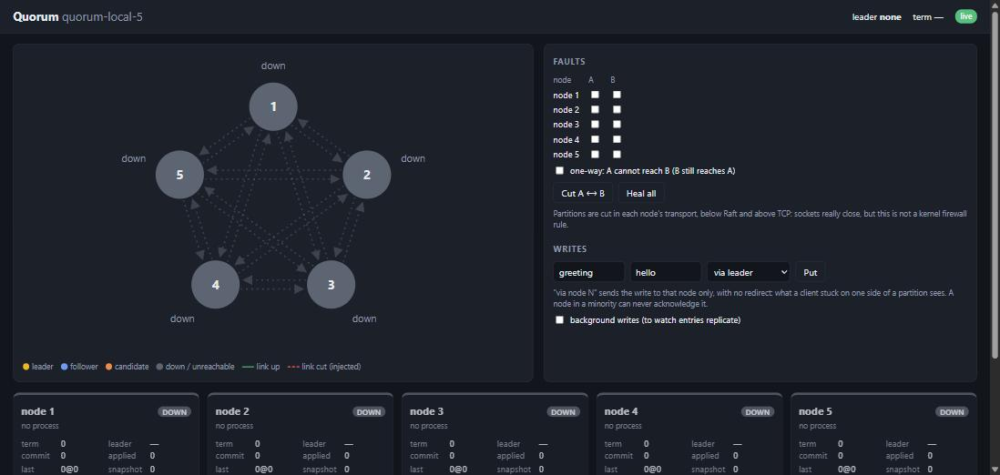
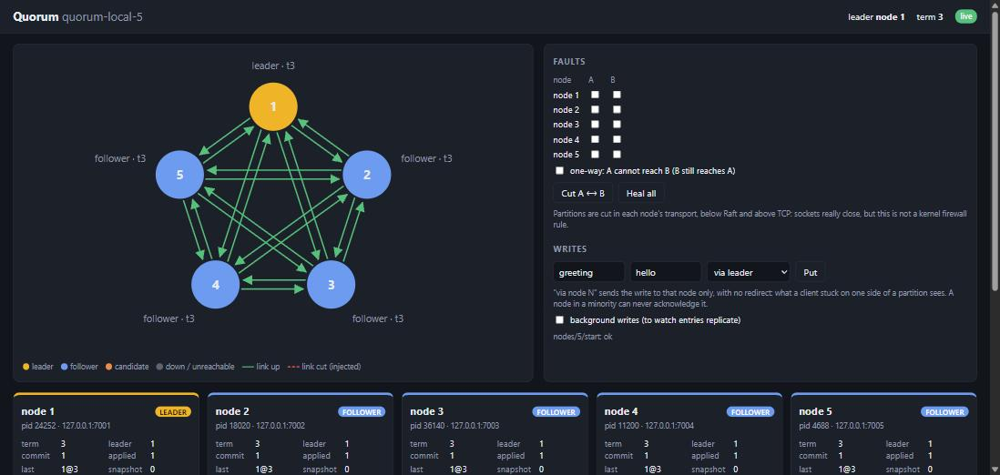
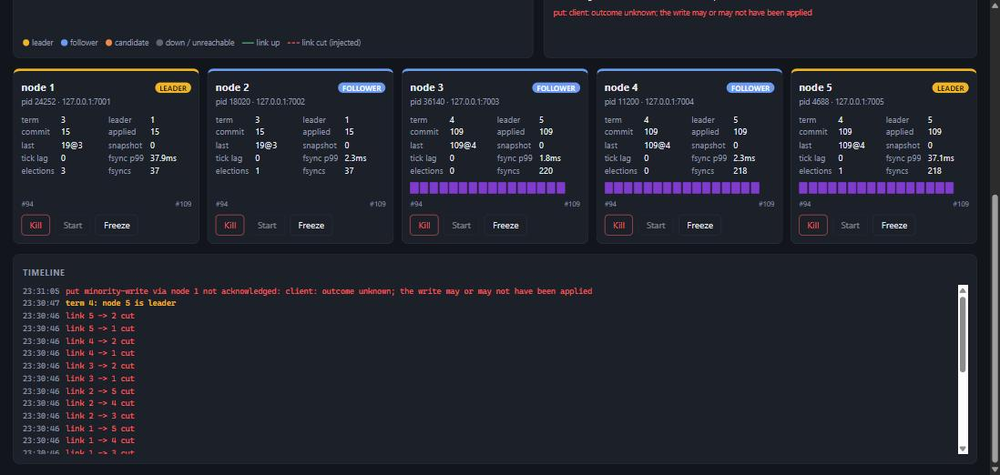
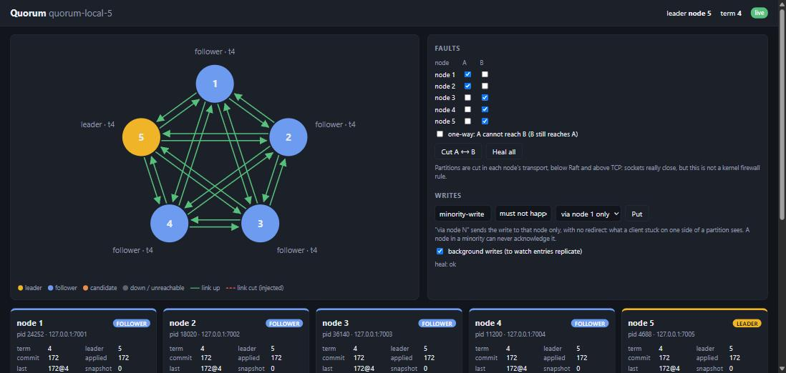
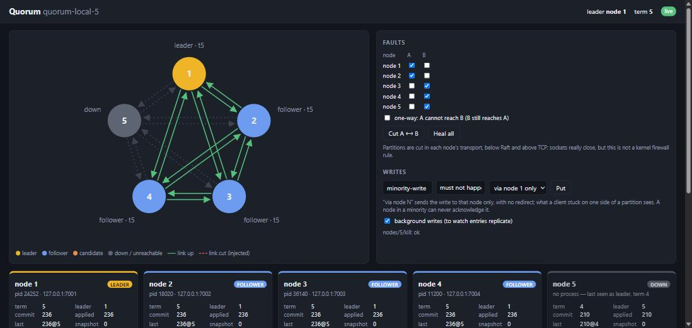
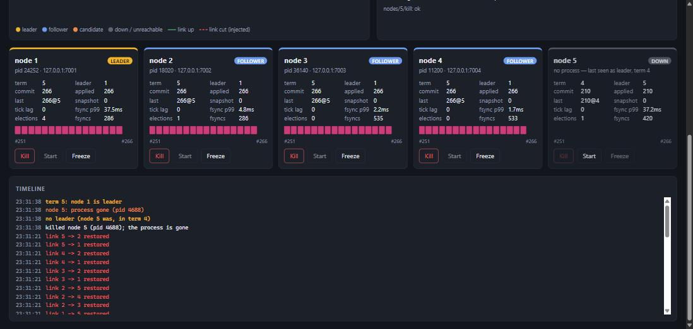
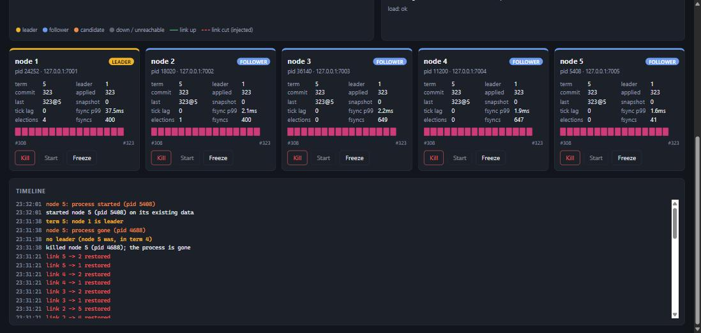

# Walkthrough: watching Quorum fail and recover

Eight frames from one session of the live visualizer (`make viz`) against the
five-node `cluster-5.yaml`, recorded on Windows on 2026-09-30. Every action was
taken with the page's own buttons, which go through the same supervisor and
admin calls as `quorumctl` and the fault-injection suite. Nothing is staged:
the numbers are what the real processes reported at the time.

It shows the three things PLAN.md phase 8 asks for — a normal election, a
partition with the minority refusing writes, and a leader kill followed by
recovery — plus the heal in between.

## 1. Cold start

The visualizer was started with `-no-start`, so every node is configured but
has no process. Links are drawn grey and dotted: nothing to connect.

## 2. A normal election

Each node was started from its card. Node 1 won the election, in term 3: the
nodes came up a few hundred milliseconds apart, and the first ones to time
out campaigned before a majority existed. Every node shows commit 1 -- the
no-op a new leader commits so it learns its commit index (DESIGN.md §4).

## 3. Partition: {1, 2} cut off from {3, 4, 5}

Background writes were switched on, then the partition builder cut nodes 1
and 2 off from 3, 4 and 5 in both directions: every link between the groups
is a red dashed arrow. The majority elected node 5 in term 4 and kept
committing (commit 42). Node 1 still believes it leads, in term 3 -- nothing
has told it otherwise -- but its commit index is stuck at 15. Two nodes show
the leader badge; only one leads the current term, and the header says which.

## 4. The minority refuses a write

A write was sent through node 1 only ("via node 1 only": no redirects, as a
client stuck on that side would be). Node 1 cannot commit without a majority,
so the write is never acknowledged: the timeline records `put minority-write
via node 1 not acknowledged`. Meanwhile the majority's commit index has run
on to 109 while the minority's stays at 15.

Recording this frame found a real bug. The first attempt showed the
majority's commit index frozen: the background writer's client was trapped
between the stale leader and its follower's redirects, and never reached the
majority. It is in [BUGS.md](../../BUGS.md) (2026-09-30), fixed and guarded
by `TestClientEscapesAStaleMinority`; these frames are from the re-recording.

## 5. Healed

"Heal all" restored every link. Node 1 heard term 4 and stepped down; its
uncommitted term-3 entries were overwritten by the leader's. All five nodes
now report the same log -- last entry 172 in term 4, all committed. The
refused write is nowhere.

## 6. Kill the leader

The leader, node 5, was killed from its card: a real `TerminateProcess`, and
the process is gone. The node is drawn grey, its links dotted, and a new
leader -- node 1 -- leads term 5 with the remaining four.

## 7. The election, on the timeline

The same moment, scrolled down: `killed node 5 (pid 4688); the process is
gone`, `no leader (node 5 was, in term 4)`, `node 5: process gone`,
`term 5: node 1 is leader` -- all within the same second. Node 5's card keeps
its last report, marked "no process — last seen as leader, term 4". Its log
strip is blank because its last reported entry, 210, is already behind the
window of indices shown (#251–#266). The writes kept committing (commit 266)
throughout.

## 8. Recovered

Node 5 was started again on its existing data directory. It came back as a
follower in term 5 and caught up to exactly the leader's log (323@5) -- and
its return did not force an election: the term is still 5 (see BUGS.md,
"Restarting any node forced an election", for why that used to be otherwise).

---

What these frames are not: a partition here is cut in each node's transport,
below Raft and above TCP -- sockets really close, but it is not a kernel
firewall rule. And a freeze, which this session did not use, is cooperative,
not `SIGSTOP`. See DESIGN.md §3.
